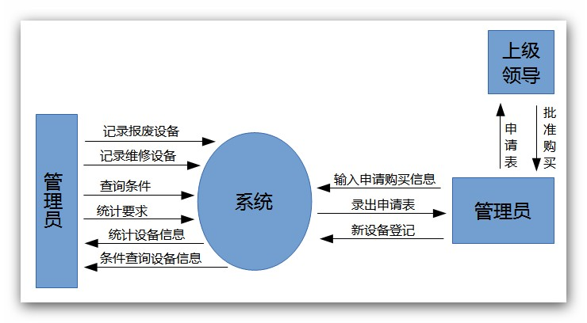
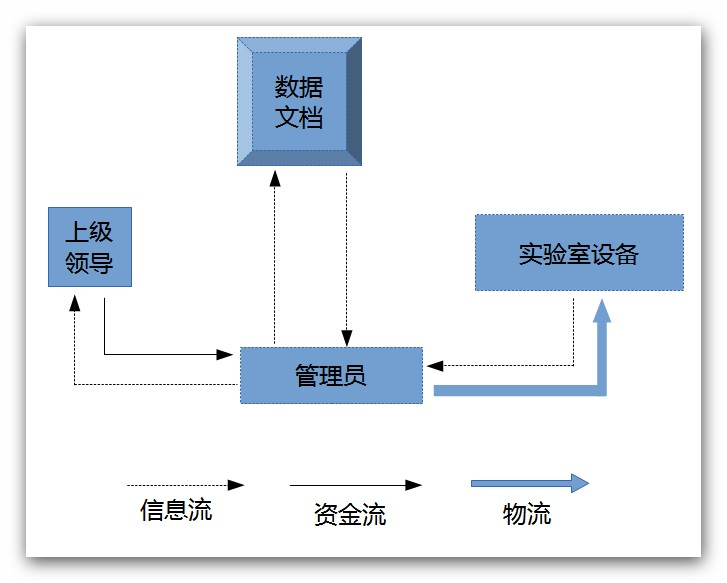

# 实验室设备管理系统
**可行性研究报告**

# 1.引言

## 1.1编写目的
> 编写本报告的目的是研究本系统的总体需求、实现方案，并分析开发系统的可行性，为决策者提供是否开发该系统的依据和建议。

## 1.2项目背景
> 开发软件名称：实验室设备管理系统。

> 项目开发者：闽江学院计算机科学系“实验室设备管理系统”开发小组：

> > 郑仲（2号 组长）

> > 黄铭达（25号）

> > 柯肇丰（36号）

> > 张锋（15号）

> > 刘云辉（49号）

> > 雷贤明（36号）

> > 用户单位：闽江学院

## 1.3定义
> 实验室设备管理系统对于现代化设备管理而言，可以使购进以后将设备的基本情况和相关信息登记存档，设备的变迁或损坏都记录在设备档案中。使用者而已快速高效地反馈设备状况与需求。管理人员将管理任务分成小块，落实到个人并能随时查询设备当前情况和历史情况，对设备的可靠性分析有直接作用，使管理人员从手工计算、统计工作中解脱出来。

## 1.4参考资料
> 钱乐秋等，《软件工程》，青还大学出版社；
张害藩，《软件工程导论》（第四版），清华大学出版社；
王珊等，《数据库原理及设计》，清华大学出版社；
赵池龙等，《软件工程实践教程》，电子工业出版社。

# 2.可行性研究的前提
> 因为现在各个高校内教学设备众多但自动管理水平相比过低，很多高校管理设备都采用在设备购进以后将设备的基本情况和相关信息登记存档。存档以后档案基本就没人记录与维护，至于以后设备的变迁或损坏都不会记录在设备档案中，即不能体现设备的即时状态。而有些即使有设备管理系统的单位，就算是能把设备的即时信息体现在设备档案上，但设备的缺陷处理及设备缺陷等功能没有实施，设备检修的备品备件情况和检修成本核算没有实现，整个学校教学设备管理信息化仍处于较低水平。

> 将管理任务分成小块，落实到个人并能随时查询设备当前情况和历史情况，对设备的可靠性分析有直接作用，使管理人员从手工计算、统计工作中解脱出来。
## 2.1要求
> ### A、主要功能
> > 报废处理：对于已彻底损坏的作报废处理，同时详细记录有关信息。
> 
> > 报修处理：对于有严重问题（故障）的要即使修理，并记录修理日期、设备名、修理厂家、修理费、责任人等。
> 
> > 设备申请与购入：对于急需但又缺少的设备需以“申请表”的形式送交上级领导请求批准购买。新设备购入后要立即进行设备登记（包括类别、设备名、型号、规格、单价、数量、购置日期、生产厂家、购买人等），同时更新申请表的内容。
> 
> > 数据查询：随时对现有设备及其修理、报废情况进行统计、查询，要求能够按类别和时间段（某日期之前）查询。

> ### B、主要性能
> > 可以方便快捷有效地完成统计、更新等的各项操作，录入数据合法性校验程序高，查询速度快（不超5秒）。保证信息的正确和及时更新，并降低信息访问的成本。技术先进且高可靠性。

> ### C、可扩展性
> > 能够适应应用要求的变化和修改，具有灵活的可扩充性。

> ### D、安全性
> > 所有工作由专门人员负责完成，其他人不得任意使用。

> > 每件设备在作入库登记时均由系统按类别自动顺序编号，形成设备号；设备报废时要及时修改相应的设备记录，且有领导认可。

> ### E、完成期限
> > 2013年3月20日至8月20日，共6个月。

## 2.2目标
> 所建议系统的开发目标包括:

> - 减少人力与管理费用；
> - 提高信息准确度；
> - 改进管理和服务;
> - 建立高效的信息传输和服务平台，提高信息处理速度和利用率。

## 2.3条件，假定和限定
> - 建议软件寿命：10年。
> - 进行系统方案选择比较的时间：为10天。
> - 经济来源：闽江学院。
> - 硬件条件：PC机至少1台，服务器1台，局域网，INTERNET。
> - 软件条件：WINDOWS 2003Server和XP操作系统，ORACLE/SQL Server 数据库，浏览器等。

## 2.4决定可行性的主要因素
>本次可行性分析是按照软件工程的规范步骤进行的，即按复查项目目标和规模，研究目前正使用的系统，导出新系统的高层逻辑模型，重新定义问题这一循环反复的过程进行。然后提出系统的实现方案，推荐最佳方案，对所推荐的方案进行经济、技术、用户操作和法律的可行性分析，最后给出系统是否值得开发的结论。以上分析结果写城本文档。

> - 成本/效益分析结果：效益>成本；
> - 技术可行：现有技术可完成开发任务；
> - 操作可行：系统能被现有的工作人员快速掌握并使用；
> - 法律可行：所使用工具和技术及数据信息不违反法律。

# 3.对现有系统的分析
## 3.1业务流程及数据流图
### （1）组织结构图与信息流关系

**组织结构与信息流关系图**
### （2）顶层数据流图

**顶层数据流图**

# 4.所建议的系统
>所建议系统是C/S和B/S模式结合。报废处理、数据查询、设备申请与购入、报修处理等读写功能通过客户端实现，并在客户端保存数据，数据可导入导出加密备份，有利于提高系统的效率和安全性。

## 4.1影响
> 在建立所建议系统时，预期会带来的影响包括以下几个方面。

> - 对设备的影响
> > 由于所建议系统是基于WINDOWS操作系统和互联网的，所以需要配备足够符合以上列出的各种软硬件条件的计算机和通信线路。系统失效后，服务器端需要利用备份的数据库恢复数据信息，要求要有足够的数据备份空间。

> - 对软件的影响
> > 需要落实是否有符合本报告所列出的正版的软件环境，如果没有则需要购买。

> - 对用户单位机构的影响
> > 投入使用前还需改进现有的管理模式。

> - 对开发的影响
> > 开发过程需要用户进行密切的配合，准确阐明需求。

> - 对经费开支的影响：
> > 除了需要支付开发单位的有关费用外，每年还需要一定的运行维护费用（见经济可行性分析）。

## 4.2 技术条件方面的可行性
> 本系统是一个基于局域网、互联网和WINDOWS操作的系统，现有技术已较为成熟，利用现有技术完全可以实现系统开发目标。同时，开发期限较为宽裕，预计可以在规定期限内完成开发任务。

# 5.经济可行性分析
## 5.1投资成本

> - 一次性支出
> > （1）系统开发、建立费用共19万元。其中：

> > - 本系统开发期为6个月，需开发人员6人（不一定都是参加满6个月）。根据软件系统的规模估算，开发工作量约为30人月，每人月的人工费按5000元计算，开发费用为15万元。
> > - 设备、人员等基础信息建立需要10人2个月即20人月，每人月的人工费用按2000元计算，需4万元。

> > （2）硬件设备费共5万元，其中：微机6台约3万元；服务器1台及网络等设备费5万元。

> > （3）外购开发工具、软件环境费用共5万元。

> > （4）其他费费用共2万元。

> > 一次性支出总费用：31万元。

> - 经常性费用
> > 主要是系统运行费用，假设本系统运行期10年，每年的运行费用（包括系统维护、设备维护等）5万元，按年利率5%计算如下表。
> > 系统投资成本总额为：31+38.6082=69.6082万元。
<table>
	<caption>
		运行费用表
	</caption>
	<thead>
		<tr>
			<th>年份</th>
			<th>将来费用（万元）</th>
			<th>（1+0.05）N</th>
			<th>现在费用值（万元）</th>
			<th>累计现在费用值（万元）</th>
		</tr>
	</thead>
	<tr>
		<td>第一年</td>
		<td>5</td>
		<td>1.05</td>
		<td>4.7619</td>
		<td>4.7619</td>
	</tr>
	<tr>
		<td>第二年</td>
		<td>5</td>
		<td>1.1025</td>
		<td>4.5351</td>
		<td>9.2970</td>
	</tr>
	<tr>
		<td>第三年</td>
		<td>5</td>
		<td>1.1576</td>
		<td>4.3191</td>
		<td>13.6161</td>
	</tr>
	<tr>
		<td>第四年</td>
		<td>5</td>
		<td>1.2155</td>
		<td>4.1135</td>
		<td>17.7296</td>
	</tr>
	<tr>
		<td>第五年</td>
		<td>5</td>
		<td>1.2763</td>
		<td>3.9176</td>
		<td>21.6472</td>
	</tr>
	<tr>
		<td>第六年</td>
		<td>5</td>
		<td>1.3401</td>
		<td>3.7310</td>
		<td>25.3782</td>
	</tr>
	<tr>
		<td>第七年</td>
		<td>5</td>
		<td>1.4071</td>
		<td>3.5534</td>
		<td>28.9316</td>
	</tr>
	<tr>
		<td>第八年</td>
		<td>5</td>
		<td>1.4775</td>
		<td>3.3841</td>
		<td>32.3157</td>
	</tr>
	<tr>
		<td>第九年</td>
		<td>5</td>
		<td>1.5513</td>
		<td>3.2230</td>
		<td>35.5387</td>
	</tr>
	<tr>
		<td>第十年</td>
		<td>5</td>
		<td>1.6289</td>
		<td>3.0695</td>
		<td>38.6082</td>
	</tr>
</table>

## 5.2收益
> 假设投入本系统，效率可以提高50%，以现有的工作人员20人计算，可减少10人，每人每月平均工资按2500元计算，每年节约人员工资10×12×0.25=30万元/年。按年利率5%计算，效益计算如下表。
> 系统收益总额为：231.6437万元。
<table>
	<caption>
		效益计算表
	</caption>
	<thead>
		<tr>
			<th>年份</th>
			<th>将来收益值（万元）</th>
			<th>（1+0.05）N</th>
			<th>现在收益值（万元）</th>
			<th>累计现在收益值（万元）</th>
		</tr>
	</thead>
	<tr>
		<td>第一年</td>
		<td>30</td>
		<td>1.05</td>
		<td>28.5714</td>
		<td>28.5714</td>
	</tr>
	<tr>
		<td>第二年</td>
		<td>30</td>
		<td>1.1025</td>
		<td>27.2109</td>
		<td>55.7823</td>
	</tr>
	<tr>
		<td>第三年</td>
		<td>30</td>
		<td>1.1576</td>
		<td>25.9151</td>
		<td>81.6974</td>
	</tr>
	<tr>
		<td>第四年</td>
		<td>30</td>
		<td>1.2155</td>
		<td>24.6811</td>
		<td>106.3785</td>
	</tr>
	<tr>
		<td>第五年</td>
		<td>30</td>
		<td>1.2763</td>
		<td>23.5058</td>
		<td>129.8843</td>
	</tr>
	<tr>
		<td>第六年</td>
		<td>30</td>
		<td>1.3401</td>
		<td>22.3846</td>
		<td>152.2689</td>
	</tr>
	<tr>
		<td>第七年</td>
		<td>30</td>
		<td>1.4071</td>
		<td>21.3187</td>
		<td>173.5876</td>
	</tr>
	<tr>
		<td>第八年</td>
		<td>30</td>
		<td>1.4775</td>
		<td>20.3035</td>
		<td>193.8911</td>
	</tr>
	<tr>
		<td>第九年</td>
		<td>30</td>
		<td>1.5513</td>
		<td>19.3367</td>
		<td>213.2278</td>
	</tr>
	<tr>
		<td>第十年</td>
		<td>30</td>
		<td>1.6289</td>
		<td>18.4159</td>
		<td>231.6437</td>
	</tr>
</table>

## 5.3成本/收益分析：
> 在10年期内，系统总成本69.6082万元，系统总收益231.6437万元。
> - 投资回收期：2+(85.6082-55.7823)/25.9151=3.15年；
> - 投资回报率：×％
> > (即为69.6082=30 /(1+j)+30/（1+j）2+…+30/（1+j）10的方程解i×100)
> - 纯收益：231.6437－69.6082＝162.0355万元
> > 从经济上考虑，开发本系统完全可行的。

# 6.社会因素可行性分析
## 6.1法律方面的可行性
> 所有软件都用正版，技术资料都由提出方保管，数据信息均可保证合法来源。所以，在法律方面是可行的。

## 6.2用户使用可行性
> 使用本系统的人员均有一定计算机应用基础，系统维护员由计算机的专业人员担任，所有人员都要经过本系统的使用培训。经过简单培训人员就会熟练使用本软件。

# 7.结论
> 本项目具有方便快捷等优势，投资回报利益大，使得实验室设备管理实现电子化，符合社会信息化发展的需要，技术、经济、操作、法律方面都是可行的，可以开发本系统。