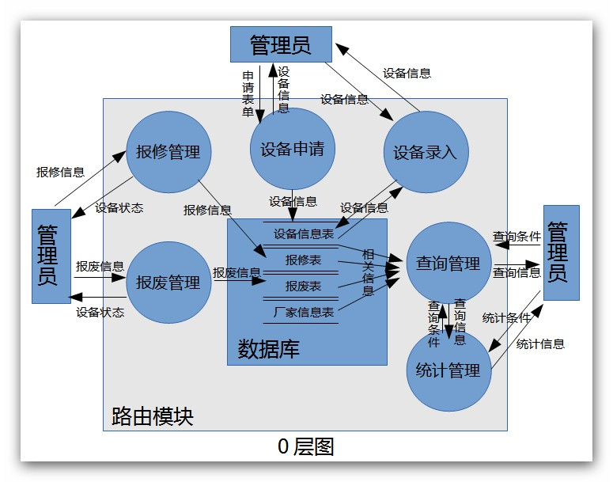
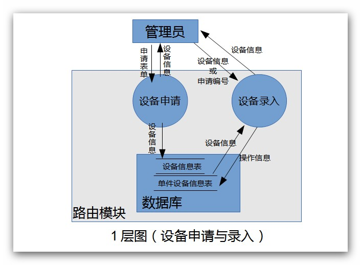
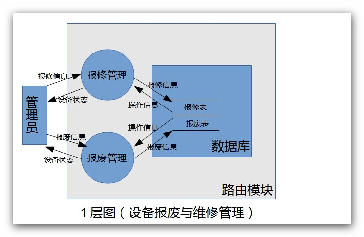
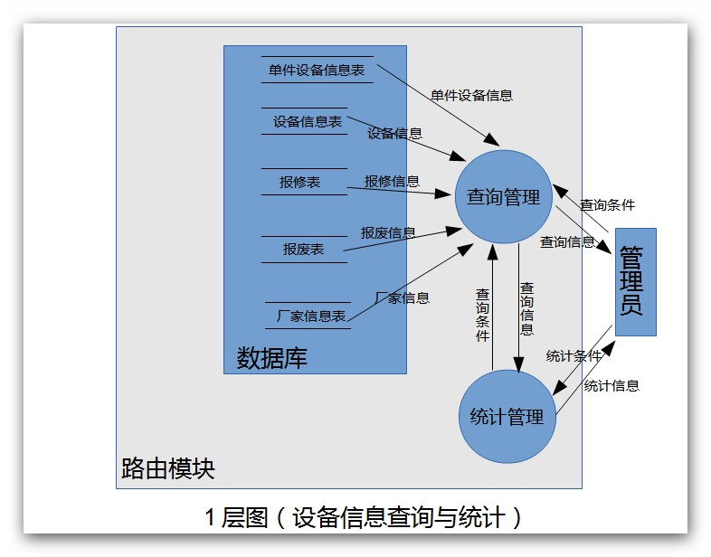

# 实验室设备管理系统
**需求规格说明书**

# 1.引言
## 1.1 编写目的
> 本开发计划的目的是：

> > a．把在开发过程中对各项工作的人员、分工、经费、系统资源条件等问题的安排用文档形式记载下来，以便根据本计划开展和检查本项目工作，保证项目开发成功；

> > b．制订项目组开发过程中的评审和审查计划，明确相应的质量管理负责人员；

> > c. 规定软件配置管理的活动内容和要求，明确配置管理工作的人员。
   
# 1.2  背景
> 项目软件名称：实验室设备管理系统。
> 实验室设备管理系统对于现代化设备管理而言，可以使购进以后将设备的基本情况和相关信息登记存档，设备的变迁或损坏都记录在设备档案中。使用者而已快速高效地反馈设备状况与需求。管理人员将管理任务分成小块，落实到个人并能随时查询设备当前情况和历史情况，对设备的可靠性分析有直接作用，使管理人员从手工计算、统计工作中解脱出来。

> 特别要求：需求分析必须详细，并且有相关专家合作进行。

> 任务来源：闽江学院。

> 项目开发者：闽江学院计算机科学系“实验室设备管理系统”开发小组：

> > 郑仲（2号 组长）

> > 黄铭达（25号）

> > 柯肇丰（36号）

> > 张锋（15号）

> > 刘云辉（49号）

> > 雷贤明（36号）

## 1.3  参考资料
> 钱乐秋，赵文耘，牛军钰.软件工程.清华大学出版社；
王珊等，《数据库原理及设计》，清华大学出版社；
赵池龙等，《软件工程实践教程》，电子工业出版社。

## 1.4  术语和缩写词 
> （暂无）

# 2.任务概要
## 2.1 工作内容
> 本项目开发过程中需要进行的主要工作为：开发符合用户需求的软件，并编制相关文档和计划。

## 2.2 产品
### 2.2.1 程序
### 2.2.2 文档
> 文档格式要求按照我国GB/T8567-1988国家标准和IEEE/ANSI830-1993标准规范要求进行。软件文档目录包括：

> * 项目开发计划
> * 可行性报告
> * 软件需求规格说明
> * 软件概要设计规格说明；
> * 软件详细设计规格说明；
> * 软件标准规范
> * 软件测试计划
> * 软件测试办法
> * 软件可靠性和安全性设计指南
> * 硬件总体设计报告
> * 软件代码
> * 测试分析报告
> * 软件可靠性和安全性设计检查单
> * 软件评审检查单
> * 软件使用说明

### 2.2.3 服务

> 培训：软件使用及安装，时间5天。
> 软件支持：略。

### 2.2.4	验收标准和验收计划

> 验收标准：经用户和开发小组负责人双方签字确认的“需求规格说明书”。重点确认软件的可靠性、易使用性和功能完整性。

# 3.需求规定

> 在实验室设备管理系统中，管理员需要建立设备信息库，用于记录设备类、与型号、规格、价单、数量、购置日期、生产厂家、购买人；建立厂家信息库，用于记录厂家信息，包括厂家名、厂家介绍、地址、联系方式、厂家信用额度等。

> 欲购入设备时，先将申请表单提交到系统中，系统将导出申请表，待申请表审核通过，系统为每台设备将生成详细设备信息，并自动编号。

> 设备的维修与报废，应及时将相应信息的表单填写提交到系统中

> 为系统维护人员提供权限管理、数据备份等通用功能。

## 3.1

> 系统维护为通用功能，这边不做具体分析

### 3.1.1 顶层图

### 3.1.2 0层图

### 3.1.3 1层图（设备申请与录入）

### 3.1.4 1层图（设备报废与维修管理）

### 3.1.5 1层图（设备信息查询与统计）

## 3.2

### 3.2.1 E-R图

### 3.2.2 数据实体结构描述

数据实体结构描述见下列各表。
<table>
	<caption>功能名称：设备信息表</caption>
	<thead>
		<tr>
			<td>存储位置：设备信息</td>
			<td>存储组织：一种设备一条数据</td>
			<td>主键：编号</td>
		</tr>
	</thead>
	<tr>
		<td>数据元素</td>
		<td>数据采集方式</td>
		<td>说明</td>
	</tr>
	<tr>
		<td>编号</td>
		<td>人工采集</td>
		<td>主键</td>
	</tr>
	<tr>
		<td>类型</td>
		<td>人工采集</td>
		<td></td>
	</tr>
	<tr>
		<td>设备名称</td>
		<td>人工采集</td>
		<td></td>
	</tr>
	<tr>
		<td>型号</td>
		<td>人工采集</td>
		<td>可空</td>
	</tr>
	<tr>
		<td>规格</td>
		<td>人工采集</td>
		<td>可空</td>
	</tr>
	<tr>
		<td>市场单价</td>
		<td>人工采集</td>
		<td></td>
	</tr>
	<tr>
		<td>数量</td>
		<td>自动采集</td>
		<td></td>
	</tr>
</table>

---

<table>
	<caption>功能名称：单件设备信息表</caption>
	<thead>
		<tr>
			<td>存储位置：设备信息</td>
			<td>存储组织：一件设备一条数据</td>
			<td>主键：编号</td>
		</tr>
	</thead>
	<tr>
		<td>数据元素</td>
		<td>数据采集方式</td>
		<td>说明</td>
	</tr>
	<tr>
		<td>编号</td>
		<td>人工采集</td>
		<td>主键</td>
	</tr>
	<tr>
		<td>设备状态</td>
		<td>人工采集</td>
		<td></td>
	</tr>
	<tr>
		<td>设备信息编号</td>
		<td>人工采集</td>
		<td></td>
	</tr>
	<tr>
		<td>生产工厂编号</td>
		<td>人工采集</td>
		<td></td>
	</tr>
	<tr>
		<td>购入价格</td>
		<td>人工采集</td>
		<td></td>
	</tr>
	<tr>
		<td>购买人编号</td>
		<td>人工采集</td>
		<td></td>
	</tr>
	<tr>
		<td>购入时间</td>
		<td>人工采集</td>
		<td></td>
	</tr>
</table>

---

<table>
	<caption>功能名称：厂家信息表</caption>
	<thead>
		<tr>
			<td>存储位置：厂家信息</td>
			<td>存储组织：一家厂家一条数据</td>
			<td>主键：编号</td>
		</tr>
	</thead>
	<tr>
		<td>数据元素</td>
		<td>数据采集方式</td>
		<td>说明</td>
	</tr>
	<tr>
		<td>编号</td>
		<td>人工采集</td>
		<td>主键</td>
	</tr>
	<tr>
		<td>厂家信息</td>
		<td>人工采集</td>
		<td></td>
	</tr>
	<tr>
		<td>厂家名称</td>
		<td>人工采集</td>
		<td></td>
	</tr>
	<tr>
		<td>厂家介绍</td>
		<td>人工采集</td>
		<td>可空</td>
	</tr>
	<tr>
		<td>联系方式</td>
		<td>人工采集</td>
		<td>可空</td>
	</tr>
</table>

---

<table>
	<caption>功能名称：报修表</caption>
	<thead>
		<tr>
			<td>存储位置：设备信息</td>
			<td>存储组织：一次维修记录一条数据</td>
			<td>主键：编号</td>
		</tr>
	</thead>
	<tr>
		<td>数据元素</td>
		<td>数据采集方式</td>
		<td>说明</td>
	</tr>
	<tr>
		<td>编号</td>
		<td>人工采集</td>
		<td>主键</td>
	</tr>
	<tr>
		<td>单件设备编号</td>
		<td>人工采集</td>
		<td></td>
	</tr>
	<tr>
		<td>维修厂家</td>
		<td>人工采集</td>
		<td>可空</td>
	</tr>
	<tr>
		<td>维修费用</td>
		<td>人工采集</td>
		<td></td>
	</tr>
	<tr>
		<td>责任人</td>
		<td>人工采集</td>
		<td>可空</td>
	</tr>
	<tr>
		<td>维修时间</td>
		<td>自动/人工采集</td>
		<td></td>
	</tr>
</table>

---

<table>
	<caption>功能名称：报废表</caption>
	<thead>
		<tr>
			<td>存储位置：设备信息</td>
			<td>存储组织：一件报废设备一条数据</td>
			<td>主键：编号</td>
		</tr>
	</thead>
	<tr>
		<td>数据元素</td>
		<td>数据采集方式</td>
		<td>说明</td>
	</tr>
	<tr>
		<td>编号</td>
		<td>人工采集</td>
		<td>主键</td>
	</tr>
	<tr>
		<td>单件设备编号</td>
		<td>人工采集</td>
		<td></td>
	</tr>
	<tr>
		<td>责任人</td>
		<td>人工采集</td>
		<td>可空</td>
	</tr>
	<tr>
		<td>报废原因</td>
		<td>人工采集</td>
		<td>可空</td>
	</tr>
	<tr>
		<td>报废时间</td>
		<td>自动/人工采集</td>
		<td></td>
	</tr>
</table>

---

## 3.3 安全需求

> 由于此开发项目仅针对设备管理员开发，对数据安全有一定要求，前期开发采取半明文半密文进行开发测试，后期完全采用密文传输，以确保数据安全。

## 3.4 其他需求

> 能快速恢复系统和故障处理，方便系统开发和扩充，故障恢复时间不超过5h。

# 4. 运行环境规定

## 4.1 硬件环境

> * 服务器

> > (1) 处理器（CPU）：Pentium 4 1.2G 或者更高

> > (2) 内存容量（RAM）：至少512M（推荐 2G）

> * 客户端

> > (1) 处理器（CPU）：单核1.3GHZ 或者更高

> > (2) 内存容量（RAM）：DDR2 256M 或更高

## 4.2 软件环境

> * 数据库服务器端

> > (1) 操作系统：Microsoft Windows 2003

> > (2) 数据库管理系统：SQL Server，配置TCP/IP协议

> * Web服务器端

> > (1) 操作系统：Microsoft Windows 2000

> > (2) Internet 信息服务（IIS）6.0管理器

> > (3) Visual Studio.NET 2003，配置TCP/IP协议

> * 客户端

> > (1) 操作系统：Windows XP/VISIT/7/8

> > (2) Web浏览器：Internet Explorer 8或者更高、Firefox、Chrome、Opera等现代浏览器
