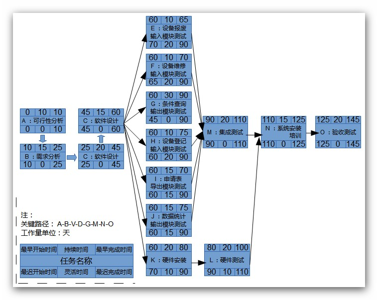

# 实验室设备管理系统
**项目开发计划**

# 1.引言
## 1.1 编写目的
> 本开发计划的目的是：

> > a．把在开发过程中对各项工作的人员、分工、经费、系统资源条件等问题的安排用文档形式记载下来，以便根据本计划开展和检查本项目工作，保证项目开发成功；

> > b．制订项目组开发过程中的评审和审查计划，明确相应的质量管理负责人员；

> > c. 规定软件配置管理的活动内容和要求，明确配置管理工作的人员。
   
# 1.2  背景
> 项目软件名称：实验室设备管理系统。
> 实验室设备管理系统对于现代化设备管理而言，可以使购进以后将设备的基本情况和相关信息登记存档，设备的变迁或损坏都记录在设备档案中。使用者而已快速高效地反馈设备状况与需求。管理人员将管理任务分成小块，落实到个人并能随时查询设备当前情况和历史情况，对设备的可靠性分析有直接作用，使管理人员从手工计算、统计工作中解脱出来。

> 特别要求：需求分析必须详细，并且有相关专家合作进行。

> 任务来源：闽江学院。

> 项目开发者：闽江学院计算机科学系“实验室设备管理系统”开发小组：

> > 郑仲（2号 组长）

> > 黄铭达（25号）

> > 柯肇丰（36号）

> > 张锋（15号）

> > 刘云辉（49号）

> > 雷贤明（36号）

## 1.3  参考资料
> 钱乐秋，赵文耘，牛军钰.软件工程.清华大学出版社；
王珊等，《数据库原理及设计》，清华大学出版社；
赵池龙等，《软件工程实践教程》，电子工业出版社。

## 1.4  术语和缩写词 
> （暂无）

# 2.任务概要
## 2.1 工作内容
> 本项目开发过程中需要进行的主要工作为：开发符合用户需求的软件，并编制相关文档和计划。

## 2.2 产品
### 2.2.1 程序
### 2.2.2 文档
> 文档格式要求按照我国GB/T8567-1988国家标准和IEEE/ANSI830-1993标准规范要求进行。软件文档目录包括：

> * 项目开发计划
> * 可行性报告
> * 软件需求规格说明
> * 软件概要设计规格说明；
> * 软件详细设计规格说明；
> * 软件标准规范
> * 软件测试计划
> * 软件测试办法
> * 软件可靠性和安全性设计指南
> * 硬件总体设计报告
> * 软件代码
> * 测试分析报告
> * 软件可靠性和安全性设计检查单
> * 软件评审检查单
> * 软件使用说明

### 2.2.3 服务

> 培训：软件使用及安装，时间5天。
> 软件支持：略。

### 2.2.4    验收标准和验收计划

>验收标准：经用户和开发小组负责人双方签字确认的“需求规格说明书”。重点确认软件的可靠性、易使用性和功能完整性。

# 3.实施总计划
## 3.1  阶段划分
> 1. 可行性分析：10天
> 1. 需求分析：15天；
> 1. 软件设计(概要设计和详细设计)：20天；
> 1. 数据库建立：15天；

> **(以下6个子系统可并行编码、单元测试)**

> 1. 子系统1编码测试：5天;
> 1. 子系统1编码测试：10天;
> 1. 子系统1编码测试：30天;
> 1. 子系统1编码测试：15天;
> 1. 子系统1编码测试：10天;
> 1. 子系统1编码测试：15天;
> 1. 硬件安装:20天;
> 1. 硬件测试:20天;
> 1. 集成测试：20天;
> 1. 系统安装、培训：15天；
> 1. 验收测试:20天

## 3.2  人员组成
<table>
    <caption>
        人员组成表
    </caption>
    <thead>
        <tr>
            <td>角色</td>
            <td>参加人员</td>
        </tr>
    </thead>
    <tr>
        <td>项目管理</td>
        <td>参加人员</td>
    </tr>
    <tr>
        <td>分析员</td>
        <td>黄铭达</td>
    </tr>
    <tr>
        <td>高级程序员</td>
        <td>雷贤明、柯肇丰</td>
    </tr>
    <tr>
        <td>测试人员</td>
        <td>郑仲</td>
    </tr>
    <tr>
        <td>配置管理员、文档编制辅助人员、培训师</td>
        <td>张锋</td>
    </tr>
    <tr>
        <td>硬件安装、测试人员 </td>
        <td>刘云辉</td>
    </tr>
</table>

## 3.3  任务的分解和人员分工
<table>
    <caption>
        任务分解和人员分工表
    </caption>
    <thead>
        <tr>
            <td>任务</td>
            <td>姓名</td>
            <td>参加时间</td>
        </tr>
    </thead>
    <tr>
        <td>项目管理</td>
        <td>郑仲</td>
        <td>全部</td>
    </tr>   

    <tr>
        <td>软件配置管理，质量保证</td>
        <td>刘云辉</td>
        <td>全部</td>
    </tr>   

    <tr>
        <td>可行性分析</td>
        <td>张锋</td>
        <td>全部</td>
    </tr>   

    <tr>
        <td>需求分析</td>
        <td>黄铭达</td>
        <td>全部</td>
    </tr>   

    <tr>
        <td>软件设计</td>
        <td>柯肇丰</td>
        <td>全部</td>
    </tr>   

    <tr>
        <td>数据库建立</td>
        <td>雷贤明</td>
        <td>全部</td>
    </tr>   

    <tr>
        <td>设备报废输入编码、测试</td>
        <td>柯肇丰</td>
        <td>全部</td>
    </tr>   

    <tr>
        <td>设备维修输入编码、测试</td>
        <td>柯肇丰</td>
        <td>全部</td>
    </tr>   

    <tr>
        <td>条件查询输出编码、测试</td>
        <td>黄铭达</td>
        <td>全部</td>
    </tr>   

    <tr>
        <td>设备登记输入编码、测试</td>
        <td>柯肇丰</td>
        <td>全部</td>
    </tr>   

    <tr>
        <td>申请表导出编码、测试</td>
        <td>黄铭达</td>
        <td>全部</td>
    </tr>   

    <tr>
        <td>数据统计输出编码、测试</td>
        <td>雷贤明</td>
        <td>全部</td>
    </tr>   

    <tr>
        <td>硬件安装</td>
        <td>刘云辉</td>
        <td>全部</td>
    </tr>   

    <tr>
        <td>硬件测试</td>
        <td>刘云辉</td>
        <td>全部</td>
    </tr>   

    <tr>
        <td>模块、集成测试</td>
        <td>郑仲</td>
        <td>全部</td>
    </tr>   

    <tr>
        <td>系统安装/培训</td>
        <td>黄铭达</td>
        <td>全部</td>
    </tr>   

    <tr>
        <td>验收测试</td>
        <td>郑仲</td>
        <td>全部</td>
    </tr>   
</table>

> 用户单位领导小组：
> > 负责人：郑仲
> > 成员：黄铭达、柯肇丰、张锋、刘云辉、雷贤明
> > 职责：提供、协调、确认需求，验收测试。

## 3.4 进度和完成的最后期限
> 项目启动时间：2013-3-20
> 项目交付时间：2013-8-20
> 进度：包括可行性分析、需求分析、软件概要设计、软件详细设计、编码、测试、安装、转换、确认、培训等阶段活动和任务的进度安排，具体安排见“PERT网络图”和“进度计划表”。

**PERT网络图**

<table>
    <caption>
        “实验室设备管理系统”进度计划表
    </caption>
    <thead>
        <tr>
            <td>活动编号</td>
            <td>活动任务名称</td>
            <td>开始时间</td>
            <td>结束时间</td>
            <td>持续时间（天）</td>
            <td>负责人</td>
            <td>参加人员</td>
            <td>预算经费（元）</td>
            <td>其它资源</td>
        </tr>
    </thead>
    <tr>
        <td>A</td>
        <td>可行性分析</td>
        <td>2007.03.1</td>
        <td>2007.03.14</td>
        <td>10</td>
        <td>张锋</td>
        <td>郑仲、刘云辉</td>
        <td>5000</td>
        <td>无</td>
    </tr>
    <tr>
        <td>B</td>
        <td>需求分析</td>
        <td>2007.03.15</td>
        <td>2007.04.04</td>
        <td>15</td>
        <td>黄铭达</td>
        <td>郑仲、雷贤明</td>
        <td>5000</td>
        <td>无</td>
    </tr>
    <tr>
        <td>C</td>
        <td>软件设计</td>
        <td>2007.04.05</td>
        <td>2007.5.07</td>
        <td>20</td>
        <td>柯肇丰</td>
        <td>雷贤明、张锋</td>
        <td>5000</td>
        <td>无</td>
    </tr>
    <tr>
        <td>D</td>
        <td>数据库建立</td>
        <td>2007.05.08</td>
        <td>2007.05.28</td>
        <td>15</td>
        <td>雷贤明</td>
        <td>柯肇丰、刘云辉</td>
        <td>5000</td>
        <td>服务器（本地电脑代替）</td>
    </tr>
    <tr>
        <td>E</td>
        <td>设备报废输入编码、测试</td>
        <td>2007.05.29</td>
        <td>2007.06.04</td>
        <td>5</td>
        <td>柯肇丰</td>
        <td>张锋、雷贤明</td>
        <td>5000</td>
        <td>无</td>
    </tr>
    <tr>
        <td>F</td>
        <td>设备维修输入编码、测试</td>
        <td>2007.05.29</td>
        <td>2007.06.11</td>
        <td>10</td>
        <td>柯肇丰</td>
        <td>张锋、雷贤明</td>
        <td>5000</td>
        <td>无</td>
    </tr>
    <tr>
        <td>G</td>
        <td>条件查询输出编码、测试</td>
        <td>2007.05.29</td>
        <td>2007.07.09</td>
        <td>30</td>
        <td>黄铭达</td>
        <td>郑仲、刘云辉</td>
        <td>10000</td>
        <td>无</td>
    </tr>
    <tr>
        <td>H</td>
        <td>设备登记输入编码、测试</td>
        <td>2007.05.29</td>
        <td>2007.06.18</td>
        <td>15</td>
        <td>柯肇丰</td>
        <td>张锋、雷贤明</td>
        <td>5000</td>
        <td>无</td>
    </tr>
    <tr>
        <td>I</td>
        <td>申请表导出编码、测试</td>
        <td>2007.05.29</td>
        <td>2007.06.11</td>
        <td>10</td>
        <td>黄铭达</td>
        <td>郑仲、刘云辉</td>
        <td>10000</td>
        <td>无</td>
    </tr>
    <tr>
        <td>J</td>
        <td>数据统计输出编码、测试</td>
        <td>2007.05.29</td>
        <td>2007.06.18</td>
        <td>15</td>
        <td>雷贤明</td>
        <td>黄铭达、刘云辉</td>
        <td>5000</td>
        <td>无</td>
    </tr>
    <tr>
        <td>K</td>
        <td>硬件安装</td>
        <td>2007.05.29</td>
        <td>2007.06.25</td>
        <td>20</td>
        <td>刘云辉</td>
        <td>雷贤明、张锋</td>
        <td>10000</td>
        <td>带无线功能的笔记本电脑</td>
    </tr>
    <tr>
        <td>L</td>
        <td>硬件测试</td>
        <td>2007.06.26</td>
        <td>2007.07.23</td>
        <td>20</td>
        <td>刘云辉</td>
        <td>雷贤明、张锋</td>
        <td>5000</td>
        <td>无</td>
    </tr>
    <tr>
        <td>M</td>
        <td>集成测试</td>
        <td>2007.07.10</td>
        <td>2007.08.06</td>
        <td>20</td>
        <td>郑仲</td>
        <td>黄铭达、刘云辉</td>
        <td>5000</td>
        <td>服务器与客户端</td>
    </tr>
    <tr>
        <td>N</td>
        <td>系统安装/培训</td>
        <td>2007.08.07</td>
        <td>2007.08.27</td>
        <td>15</td>
        <td>黄铭达</td>
        <td>郑仲、刘云辉</td>
        <td>5000</td>
        <td>无</td>
    </tr>
    <tr>
        <td>O</td>
        <td>验收测试</td>
        <td>2007.08.28</td>
        <td>2007.09.24</td>
        <td>20</td>
        <td>郑仲</td>
        <td>张锋、柯肇丰</td>
        <td>10000</td>
        <td>无</td>
    </tr>
</table>
> **(注:持续时间为扣除节假日后的时间工作时间)**

## 3.5 经费预算
> 100万元人民币

## 3.6 关键问题
> （略）

## 3.7 独立确认（验收）测试工作计划和安排
> 测试由 郑仲 负责进行；测试数据由 雷贤明 提供；编码结束后30天内；

# 4.支持需求
## 4.1 计算机系统支持
> 本软件的开发需要工作平台。

> * 硬件环境：

> > * 服务器

> > > (1) 处理器（CPU）：Pentium 4 1.2G 或者更高

> > > (2) 内存容量（RAM）：至少512M（推荐 2G）

> > * 客户端

> > > (1) 处理器（CPU）：单核1.3GHZ 或者更高

> > > (2) 内存容量（RAM）：DDR2 256M 或更高

> * 软件环境

> > * 数据库服务器端

> > > (1) 操作系统：Microsoft Windows 2003

> > > (2) 数据库管理系统：SQL Server，配置TCP/IP协议

> > * Web服务器端

> > > (1) 操作系统：Microsoft Windows 2000

> > > (2) Internet 信息服务（IIS）6.0管理器

> > > (3) Visual Studio.NET 2003，配置TCP/IP协议

> > * 客户端

> > > (1) 操作系统：Windows XP/VISIT/7/8

> > > (2) Web浏览器：Internet Explorer 8或者更高、Firefox、Chrome、Opera等现代浏览器

## 4.2 需要交办单位承担的工作
> 在需求分析和安装、测试、培训期间，合理安排本单位工作，为开发小组提供足够的时间、人员支持。

## 4.3 需要其它单位提供的条件
> 测试数据。

# 5.质量保证
> 质量审核：郑仲、黄铭达 。

## 5.1 评审和审查计划
> 见评审表。

## 5.2 标准、条例和约定
> 代码每日发送到小组共享区（托管于GIthub），由柯肇丰提取。

## 5.3  人员
> 郑仲（组长）、黄铭达、柯肇丰、张锋、刘云辉、雷贤明

## 5.4  对任务间接承办单位的管理
> （略）

# 6.专题计划要点
> 以三个代表为核心、实现"中国梦"
